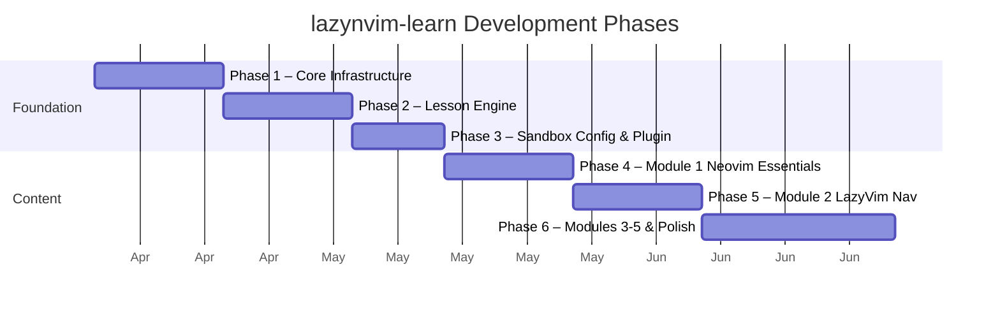
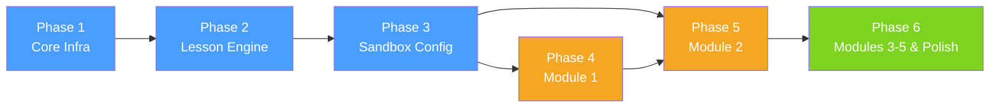

# Roadmap Overview

## Target

- Neovim **0.12.1+** only (no backwards compatibility with older versions)
- Bash 4.0+, tmux (any recent version), git

## Phases

| Phase | Name | Description |
|-------|------|-------------|
| 1 | [Core Infrastructure](./01-core-infrastructure.md) | Entry point, library scaffolding, sandbox, UI primitives |
| 2 | [Lesson Engine](./02-lesson-engine.md) | Engine state machine, progress tracking, verification framework |
| 3 | [Sandbox Config & Companion Plugin](./03-sandbox-config.md) | LazyVim sandbox config, companion plugin, first-run bootstrap |
| 4 | [Module 1 — Neovim Essentials](./04-module-1-neovim-essentials.md) | 5 lessons: modal editing, motions, text objects, buffers/windows, registers |
| 5 | [Module 2 — LazyVim Navigation](./05-module-2-lazyvim-navigation.md) | 5 lessons: overview, Neo-tree, Telescope, Flash.nvim, Which-Key |
| 6 | [Modules 3–5 & Polish](./06-modules-3-5-and-polish.md) | Editing power, customization, workflows, end-to-end testing, release |

## Dependency Graph

