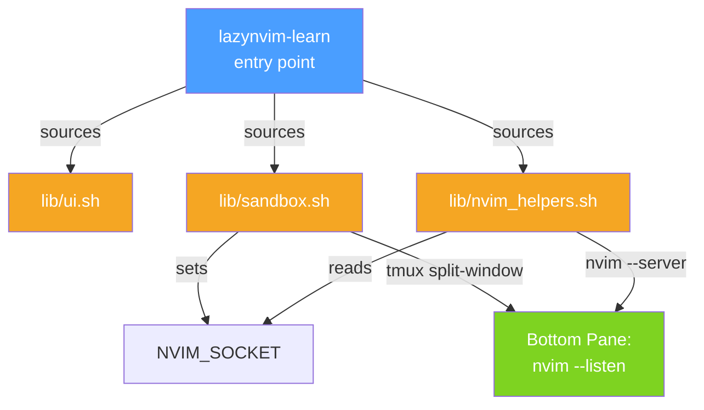

# Phase 1: Core Infrastructure

## Goal

Stand up the executable entry point, library scaffolding, tmux pane management, and the Neovim sandbox lifecycle. At the end of this phase, running `./lazynvim-learn` inside tmux should split the window, launch a sandboxed Neovim in the bottom pane, and respond to basic RPC queries.

## Deliverables

### 1.1 Entry Point (`lazynvim-learn`)

- Bash executable with shebang, `set -euo pipefail`
- Prerequisite checks:
  - bash 4.0+
  - nvim 0.12.1+ (use `nvim --version` parsing; reject anything older)
  - tmux running and `$TMUX` set (exit with helpful message if not)
  - git available
- Source all `lib/*.sh` files
- Placeholder main menu loop (module list, quit)
- `--reset-config` flag to force re-setup
- `--version` flag

### 1.2 UI Primitives (`lib/ui.sh`)

- ANSI color constants and reset
- `ui_header`, `ui_subheader` — boxed section headers
- `ui_print`, `ui_print_wrapped` — text output with word wrap
- `ui_typewriter` — character-by-character text output
- `ui_prompt` — wait for user input
- `ui_term_width` — query pane width via `tmux display-message -p '#{pane_width}'`
- `ui_clear` — clear the pane
- `ui_success`, `ui_error`, `ui_warn` — colored status messages
- `ui_menu` — numbered menu selection

### 1.3 Neovim Helpers (`lib/nvim_helpers.sh`)

- `NVIM_SOCKET` global (set by sandbox)
- Low-level: `nvim_eval`, `nvim_lua`, `nvim_exec`, `nvim_send_keys`
- State getters: `nvim_is_running`, `nvim_wait_ready`, `nvim_get_mode`, `nvim_get_bufname`, `nvim_get_filetype`, `nvim_get_cursor`, `nvim_get_line`, `nvim_get_current_line`, `nvim_get_register`, `nvim_get_option`, `nvim_get_var`
- All functions use `nvim --server "$NVIM_SOCKET"` (nvim 0.12.1 supports this natively)

### 1.4 Sandbox Lifecycle (`lib/sandbox.sh`)

- `NVIM_APPNAME="lazynvim-learn"`, `NVIM_SOCKET="/tmp/lazynvim-learn-$$.sock"`
- `sandbox_launch [file]` — `tmux split-window` + `nvim --listen $NVIM_SOCKET`
- `sandbox_kill` — kill the nvim process and tmux pane
- `sandbox_reset [file]` — kill + relaunch
- `sandbox_open_file "path"` — `:e path` in running instance
- `sandbox_setup_exercise "dir"` — copy exercise files to temp dir, open in nvim
- `sandbox_is_alive` — check pane and process

## Component Diagram

## Acceptance Criteria

- [ ] `./lazynvim-learn` exits with clear error outside tmux
- [ ] `./lazynvim-learn` exits with clear error if nvim < 0.12.1
- [ ] Running inside tmux splits the window and launches sandboxed nvim
- [ ] `nvim_eval "1+1"` returns `2` through the socket
- [ ] `sandbox_kill` cleanly closes the pane
- [ ] `sandbox_reset` restarts nvim with a fresh state
- [ ] `--version` prints version, `--reset-config` is accepted
