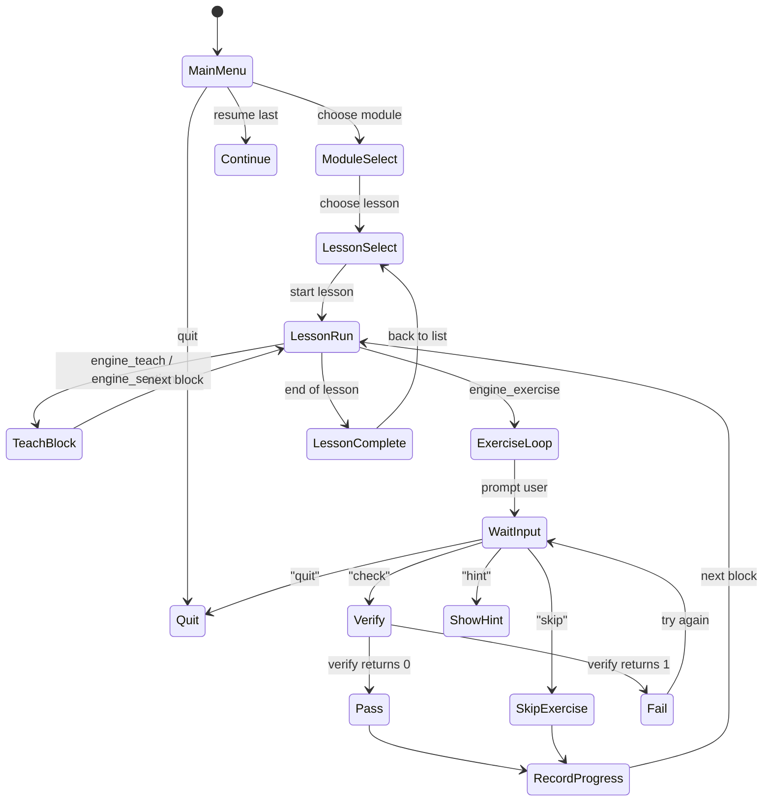

# Phase 2: Lesson Engine

## Goal

Build the lesson runner state machine, exercise loop, progress tracking, and verification framework. At the end of this phase, a dummy lesson file can be loaded and run end-to-end: teach content, present an exercise, verify the result via Neovim RPC, and record progress.

## Dependencies

- Phase 1 (entry point, UI, nvim helpers, sandbox)

## Deliverables

### 2.1 Engine (`lib/engine.sh`)

The lesson authoring API:

- `engine_section "Title"` — render section header via `ui_header`
- `engine_teach "Text"` — typewriter-style instruction block
- `engine_pause` — "Press Enter to continue"
- `engine_demo "description" "command"` — demonstrate a vim command (executes in sandbox via RPC)
- `engine_show_key "prefix" "key" "description"` — formatted keybinding display
- `engine_quiz "Question?" "A" "B" "C" correct_index` — multiple-choice quiz
- `engine_exercise "id" "Title" "Instructions" verify_func "hint" "sandbox-type"` — the exercise loop:
  1. Set up sandbox per sandbox-type (`file`, `dir`, `empty`, `config`, `current`, `none`)
  2. Display instructions
  3. Wait for user to type `check`, `hint`, `skip`, or `quit`
  4. On `check`: call `verify_func`, show pass/fail
  5. Loop until pass or skip
  6. Record result
- `engine_nvim_keys "keys"` — send keystrokes to sandbox for demos
- `engine_nvim_open "file"` — open file in sandbox

### 2.2 Progress Tracking (`lib/progress.sh`)

- Flat file at `~/.lazynvim-learn/progress`
- Format: `module/lesson-name:status` (`complete`, `in-progress`)
- `progress_mark_complete "module/lesson"`
- `progress_mark_in_progress "module/lesson"`
- `progress_is_complete "module/lesson"` — returns 0/1
- `progress_module_percent "module"` — returns completion percentage
- `progress_reset` — clear all progress
- Module unlock gate: 80% of previous module required

### 2.3 Verification Framework (`lib/verify.sh`)

Standard verification functions (all set `VERIFY_MESSAGE`, return 0/1):

**Buffer state:** `verify_file_open`, `verify_file_in_buffers`, `verify_buffer_contains`, `verify_buffer_not_contains`, `verify_line_content`, `verify_line_count`, `verify_buffer_modified`

**Cursor/mode:** `verify_mode`, `verify_cursor_line`, `verify_cursor_col`, `verify_cursor_on_pattern`

**Windows:** `verify_window_count`, `verify_split_has_file`

**Registers:** `verify_register_contains`, `verify_register_not_empty`

**LSP:** `verify_lsp_attached`, `verify_jumped_to_line`

**Plugin state:** `verify_plugin_installed`, `verify_plugin_loaded`, `verify_keymap_exists`, `verify_filetype_visible`

**Filesystem:** `verify_file_exists_on_disk`, `verify_file_not_exists_on_disk`

**Git:** `verify_git_commit_exists`

**Compound:** `verify_all` (AND multiple verifiers), `verify_via_companion` (delegate to Lua plugin)

### 2.4 Lesson Loader

- Discover lessons from `lessons/<module>/<nn>-<topic>.sh`
- Source a lesson file, call `lesson_info()` to get metadata
- Build module list and lesson list for the main menu
- Call `lesson_run()` to execute the selected lesson

## State Machine

## Acceptance Criteria

- [ ] A test lesson file can be sourced and run with teach, quiz, and exercise blocks
- [ ] Exercise loop accepts `check`, `hint`, `skip`, `quit`
- [ ] Verification functions correctly query nvim state via RPC
- [ ] Progress file is written and read correctly
- [ ] Module unlock gate enforces 80% threshold
- [ ] `verify_all` composes multiple checks correctly
- [ ] Lesson discovery finds all `lessons/**/*.sh` files and sorts them
