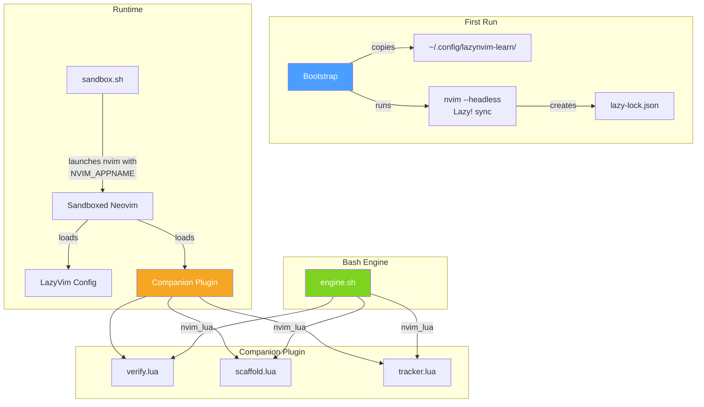

# Phase 3: Sandbox Config & Companion Plugin

## Goal

Build the complete LazyVim sandbox configuration and companion Neovim plugin. Implement the first-run bootstrap that copies the config and syncs plugins. At the end of this phase, the sandbox Neovim launches with a fully working LazyVim setup and the companion plugin responds to RPC calls from the bash engine.

## Dependencies

- Phase 2 (engine, verification framework — needed to test companion verifiers)

## Deliverables

### 3.1 LazyVim Sandbox Config (`configs/base/`)

A complete LazyVim configuration under `configs/base/lua/`:

- `config/lazy.lua` — lazy.nvim bootstrap, LazyVim plugin spec import
- `config/options.lua` — sensible defaults for the tutorial environment
- `config/keymaps.lua` — standard LazyVim keymaps (no tutorial-specific bindings)
- `config/autocmds.lua` — standard LazyVim autocommands
- `plugins/tutorial.lua` — local plugin spec for the companion plugin

Target: LazyVim on Neovim 0.12.1+. Use current lazy.nvim and LazyVim APIs (no deprecated compat shims).

### 3.2 Exercise Files (`configs/exercise-files/`)

Sample files used by exercises:

- `sample.py` — Python file with functions, classes, imports (for LSP, formatting, refactoring exercises)
- `sample.lua` — Lua file (for Treesitter, config editing exercises)
- `sample.js` — JavaScript file (for LSP, completions exercises)
- `sample.md` — Markdown file (for basic editing, text object exercises)

### 3.3 Companion Plugin (`configs/base/lua/lazynvim-learn/`)

Four modules, total < 200 lines:

**`init.lua`** — Plugin entry point (no-op setup, just makes modules requirable)

**`verify.lua`** — Verification helpers callable from bash via `nvim_lua()`:
- `telescope_is_open()` — checks for TelescopePrompt filetype window
- `neotree_showing_path(path)` — checks for neo-tree filetype window
- `breakpoint_on_line(line_num)` — queries DAP breakpoints
- `lazygit_is_open()` — checks for lazygit terminal buffer
- `symbol_renamed(old_name, new_name)` — verifies rename refactor
- `buffer_is_formatted()` — checks via conform.nvim

All return `"pass:message"` or `"fail:message:hint"` strings.

**`scaffold.lua`** — Exercise setup helpers:
- `setup_buffer(content, filetype)` — create buffer with specific content
- `setup_project(base_dir, files)` — create temp project structure
- `mark_target(line, col, text)` — extmark hint for user
- `clear_marks()` — remove all tutorial extmarks

**`tracker.lua`** — Event tracking for action-based verification:
- `reset()` / `track(event_name)` / `has_event(name)`
- `watch_lsp_rename()` / `watch_format()` — autocommand hooks

### 3.4 First-Run Bootstrap

In the entry point, before the main menu:

1. Check if `~/.config/lazynvim-learn/` exists
2. If not: copy `configs/base/` to `~/.config/lazynvim-learn/`
3. Display "Setting up LazyVim sandbox..." message
4. Run `NVIM_APPNAME=lazynvim-learn nvim --headless "+Lazy! sync" +qa`
5. Verify `lazy-lock.json` was created
6. Report success or error
7. `--reset-config` flag forces re-copy and re-sync

## Component Interaction

## Acceptance Criteria

- [ ] First run copies config and syncs plugins successfully
- [ ] Subsequent runs skip bootstrap
- [ ] `--reset-config` forces a clean re-setup
- [ ] Sandbox nvim launches with working LazyVim (statusline, Neo-tree, Telescope all functional)
- [ ] `nvim_lua "require('lazynvim-learn.verify').telescope_is_open()"` returns expected string
- [ ] `nvim_lua "require('lazynvim-learn.scaffold').setup_buffer(...)"` creates a buffer
- [ ] Companion plugin total is under 200 lines
- [ ] Exercise sample files are present and valid (no syntax errors for their languages)
