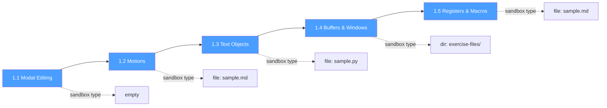
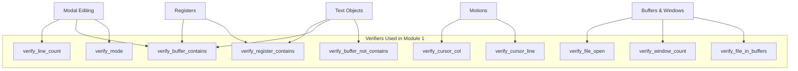

# Phase 4: Module 1 — Neovim Essentials

## Goal

Write the first 5 lessons covering core Neovim skills. This is the first real content and will validate the entire engine/verification/sandbox pipeline end-to-end. These lessons target users coming from non-modal editors.

## Dependencies

- Phase 3 (sandbox config, companion plugin, bootstrap)

## Deliverables

### 4.1 Lesson: Modal Editing (`01-modal-editing.sh`)

**Topics:** Why modes exist, Normal/Insert/Visual/Command-line modes, switching between them, the mode indicator.

**Exercises:**
1. Switch between all four modes — `verify_mode` for each
2. Enter insert mode, type a sentence, return to normal — `verify_buffer_contains` + `verify_mode`
3. Visual select a line, delete it — `verify_line_count`

### 4.2 Lesson: Motions (`02-motions.sh`)

**Topics:** Character (`hjkl`), word (`w/b/e`), line (`0/^/$`), paragraph, file (`gg/G`), search (`f/F/t/T`), screen motions.

**Exercises:**
1. Navigate to a specific line number — `verify_cursor_line`
2. Jump to a word using `f`/`t` — `verify_cursor_col`
3. Move to end of file and back — `verify_cursor_line`

### 4.3 Lesson: Text Objects (`03-text-objects.sh`)

**Topics:** Operator + motion model, `i` vs `a`, word/quote/bracket/tag/paragraph objects, combining with operators.

**Exercises:**
1. Delete a word with `diw` — `verify_buffer_not_contains`
2. Change text inside quotes with `ci"` — `verify_buffer_contains` (new text)
3. Yank a paragraph with `yip` — `verify_register_contains`

### 4.4 Lesson: Buffers and Windows (`04-buffers-windows.sh`)

**Topics:** Buffers vs windows, `:e`/`:bn`/`:bp`/`:bd`, splits, `Ctrl-w` navigation, resizing.

**Exercises:**
1. Open a second file in a new buffer — `verify_file_in_buffers`
2. Create a vertical split — `verify_window_count`
3. Navigate between splits — `verify_file_open` (different file active)

### 4.5 Lesson: Registers and Macros (`05-registers.sh`)

**Topics:** Unnamed/named/system/yank registers, `:registers`, recording macros `q{reg}`, playing `@{reg}`.

**Exercises:**
1. Yank into register `a`, paste elsewhere — `verify_register_contains`
2. Record a macro, apply to 3 lines — `verify_buffer_contains` (all 3 lines modified)

## Lesson Flow

## Verification Coverage

## Acceptance Criteria

- [ ] All 5 lessons load and run without errors
- [ ] Each exercise can be completed and verified
- [ ] Hints display on repeated failures
- [ ] Skip works for every exercise
- [ ] Progress records correctly after lesson completion
- [ ] Sandbox resets cleanly between exercises within a lesson
- [ ] 80% module completion unlocks Module 2
