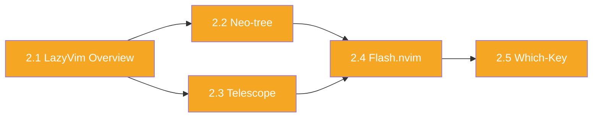
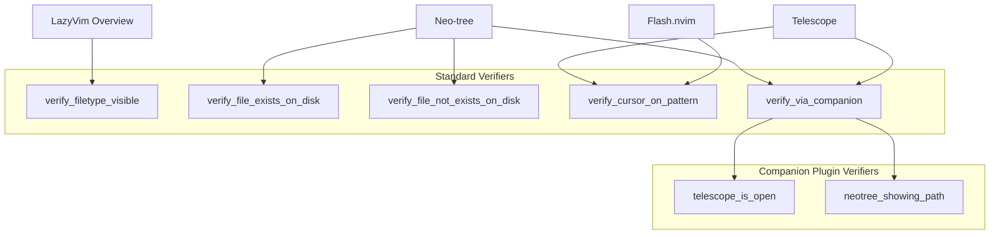

# Phase 5: Module 2 — LazyVim Navigation

## Goal

Write the 5 lessons covering LazyVim-specific navigation: the LazyVim distribution overview, Neo-tree, Telescope, Flash.nvim, and Which-Key. These lessons introduce plugin-based workflows and use the companion plugin verifiers for the first time.

## Dependencies

- Phase 4 (Module 1 validates the full pipeline; its exercises confirm verifiers work)

## Deliverables

### 5.1 Lesson: LazyVim Overview (`01-lazyvim-overview.sh`)

**Topics:** What LazyVim is, `lazy.nvim` manager, `Space` as leader, `:Lazy` dashboard, config directory structure, Extras concept.

**Exercises:**
1. Open `:Lazy` dashboard — `verify_filetype_visible "lazy"`
2. Quiz: how many plugins are installed (read from Lazy output)

### 5.2 Lesson: Neo-tree (`02-neo-tree.sh`)

**Topics:** `<leader>e` toggle, navigation, file operations (`a`/`d`/`r`/`c`/`m`), filtering, closing.

**Exercises:**
1. Open Neo-tree, navigate to a file — `verify_via_companion "neotree_showing_path"` + `verify_file_open`
2. Create a new file via Neo-tree — `verify_file_exists_on_disk`
3. Rename a file via Neo-tree — `verify_file_not_exists_on_disk` (old) + `verify_file_exists_on_disk` (new)

### 5.3 Lesson: Telescope (`03-telescope.sh`)

**Topics:** Fuzzy matching concept, `<leader>ff`, `<leader>/`, `<leader>fb`, `<leader>fr`, `<leader>s` prefix, Telescope navigation.

**Exercises:**
1. Find and open a file with `<leader>ff` — `verify_file_open`
2. Search string across files with `<leader>/` — `verify_cursor_on_pattern`
3. Switch buffer with `<leader>fb` — `verify_file_open` (different buffer)

### 5.4 Lesson: Flash.nvim (`04-flash-nvim.sh`)

**Topics:** Label-based jumping with `s`, Treesitter selection with `S`, Flash in Telescope (`Ctrl-s`), remote flash.

**Exercises:**
1. Use `s` to jump to a word — `verify_cursor_on_pattern`
2. Use `S` to select a Treesitter node — `verify_mode "v"` or visual selection active

### 5.5 Lesson: Which-Key (`05-which-key.sh`)

**Topics:** Prefix-triggered keybinding display, `<leader>` wait, `g` wait, `]`/`[` wait, discovering keymaps.

**Exercises:**
1. Quiz: keymap for Toggle Terminal
2. Quiz: keymap for Git Blame

## Lesson Flow

## New Verifiers Introduced

## Acceptance Criteria

- [ ] All 5 lessons load and run without errors
- [ ] Companion plugin verifiers (`telescope_is_open`, `neotree_showing_path`) work correctly via RPC
- [ ] Neo-tree file operations (create, rename) are verified against the filesystem
- [ ] Telescope exercises correctly detect file open after fuzzy find
- [ ] Quiz exercises validate correct answers
- [ ] Module 1 at 80%+ is required to access Module 2
- [ ] Progress tracking works across module boundary
