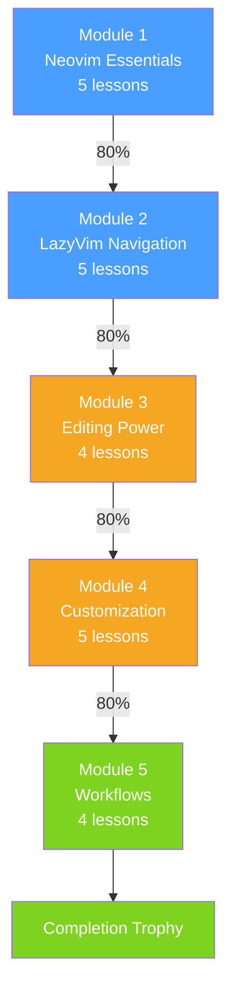
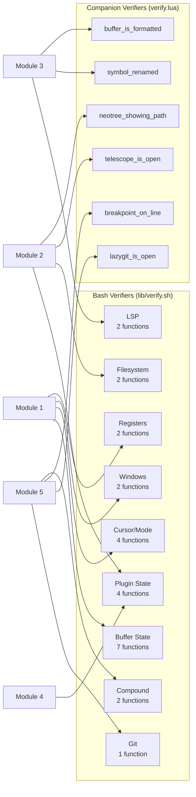

# Phase 6: Modules 3–5 & Polish

## Goal

Complete the remaining three content modules (Editing Power, Customization, Workflows), add end-to-end testing, and polish for release. This is the largest phase by content volume but follows established patterns from Phases 4–5.

## Dependencies

- Phase 5 (Module 2 content complete, all verifier types proven)

## Deliverables

### 6.1 Module 3: Editing Power (4 lessons)

| Lesson | Key Topics | Key Verifiers |
|--------|-----------|---------------|
| 3.1 LSP Basics | `gd`, `gr`, `gD`, `gI`, `K`, `<leader>cr`, `<leader>ca` | `verify_lsp_attached`, `verify_jumped_to_line`, `verify_via_companion "symbol_renamed"` |
| 3.2 Completions | nvim-cmp, `Ctrl-Space`, `Tab`/`Shift-Tab`, snippet navigation | `verify_buffer_contains` (completed text) |
| 3.3 Formatting & Linting | conform.nvim, nvim-lint, `<leader>cf`, `]d`/`[d`, `<leader>cd` | `verify_via_companion "buffer_is_formatted"`, `verify_cursor_line` |
| 3.4 Treesitter | Syntax highlighting, incremental selection, `:InspectTree` | `verify_mode` (visual), quiz |

### 6.2 Module 4: Customization (5 lessons)

| Lesson | Key Topics | Key Verifiers |
|--------|-----------|---------------|
| 4.1 LazyVim Structure | Config directory layout, `lazy.lua`, `options.lua`, `keymaps.lua` | `verify_file_open` (correct config file) |
| 4.2 Adding Plugins | Plugin spec format, `opts`, lazy-loading, `:Lazy sync` | `verify_plugin_installed`, `verify_filetype_visible "lazy"` |
| 4.3 Keymaps | `vim.keymap.set`, `keys = {}` in specs, overriding defaults | `verify_keymap_exists`, quiz |
| 4.4 Options & Autocmds | `vim.opt`, `nvim_create_autocmd`, common events | quiz |
| 4.5 LazyVim Extras | `:LazyExtras`, language/editor/formatting extras | `verify_filetype_visible`, quiz |

### 6.3 Module 5: Workflows (4 lessons)

| Lesson | Key Topics | Key Verifiers |
|--------|-----------|---------------|
| 5.1 Lazygit | `<leader>gg`, stage/commit/push, `<leader>gb`, gitsigns | `verify_via_companion "lazygit_is_open"`, `verify_git_commit_exists` |
| 5.2 Terminal | `<leader>ft`, `<leader>fT`, terminal mode, `Esc Esc` | `verify_filetype_visible "terminal"` |
| 5.3 Debugging (DAP) | `<leader>db`, `<leader>dc`, step controls, DAP UI | `verify_via_companion "breakpoint_on_line"`, quiz |
| 5.4 Putting It Together | Multi-step final challenge: find, rename, format, commit | `verify_all` (compound verifier) |

### 6.4 End-to-End Testing

A test harness that runs lessons non-interactively:

- Script that sources a lesson, simulates user input (check/skip/quit), verifies no crashes
- Run in a headless tmux session with a real nvim sandbox
- Test each lesson individually: `./test/run-lesson.sh lessons/01-neovim-essentials/01-modal-editing.sh`
- CI-friendly: can run in a Docker container with tmux + nvim 0.12.1

### 6.5 Polish

- Main menu: module list with completion percentages, continue-where-you-left-off
- Error handling: graceful recovery if nvim crashes mid-exercise
- Cleanup: `trap` handlers to kill sandbox pane on exit/interrupt
- Help text: in-app `help` command during exercises
- Completion screen: congratulations message after Module 5 final exercise

## Module Dependency Chain

## Verifier Coverage Across All Modules

## Acceptance Criteria

- [ ] All 13 remaining lessons (Modules 3–5) load and run without errors
- [ ] Module unlock chain works end-to-end (1 → 2 → 3 → 4 → 5)
- [ ] Final challenge in 5.4 uses `verify_all` to check multiple conditions
- [ ] E2E test harness can skip-through every lesson without crashes
- [ ] Sandbox cleanup runs on exit/interrupt (no orphaned nvim processes or tmux panes)
- [ ] `--reset-config` still works after full tutorial completion
- [ ] Completion screen displays after final lesson
